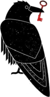

Not-so-serious stuff to be busy with in college :

❥ <a href="https://rounakdatta.github.io/2017/09/02/spc-proj.html">Serial Port Communication between μC and PC</a>
 
 

❥ <a href="https://rounakdatta.github.io/2017/09/07/pyxcy-proj.html">pyxcy - The C++ code editor written in Python</a>
 
 

❥ <a href="https://rounakdatta.github.io/2017/09/14/baradx-proj.html">BARADX Dashboard for TTC</a>
 
 

❥ <a href="https://rounakdatta.github.io/2017/10/30/imgsrvc.html">Efficient Image Server</a>
 
 

❥ <a href="https://rounakdatta.github.io/2017/11/12/srmnetlogin.html">SRM Network Login</a>
 
 

❥ <a href="https://rounakdatta.github.io/2017/12/06/gmail-attachments.html">Gmail Attachments Fetcher</a>
 
 

❥ <a href="https://rounakdatta.github.io/2017/12/08/tic-tac-toe.html">Never-Lose-Tic-Tac-Toe</a>
 
 

❥ <a href="https://rounakdatta.github.io/2017/12/26/flappybird.html">Flappy Bird</a>

 
 

❥ <a href="https://rounakdatta.github.io/2018/02/10/books-goalkeeper-dl.html">Computer Science Books Download</a>

 
 

❥ <a href="https://rounakdatta.github.io/2018/02/08/elab-quick-print.html">eLab Report Maker</a>

 
 

❥ <a href="https://rounakdatta.github.io/2018/02/13/who-is-my-roommate.html">Who is my Roommate</a>

 
 

❥ <a href="https://rounakdatta.github.io/2018/03/18/terriblytinytales.html">Terribly Tiny Tales</a>

 
 

❥ <a href="https://rounakdatta.github.io/2018/04/02/eth-lottery.html">Decentralized Lottery</a>

